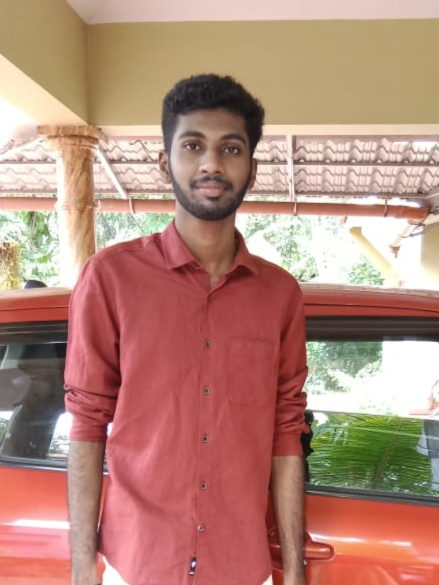

# 👋 Meet the Team!

## Jithin Jagadeesh

👋 Chairperson — 💌 jithinjagadeesh1@gmail.com

## Vishnu R Potti

👋 Vice-Chairperson — 💌 vishnurpotti.mec@gmail.com

 - Vishnu R Potti.jpg>)

## Karthik G Kumar

👋 Secretary — 💌 karthikgkumar.pro@gmail.com

<figure><figcaption></figcaption></figure>

## Lisa V C

👋 Github Campus Expert — 💌 lisaviju@gmail.com

<figure><figcaption></figcaption></figure>

## Rahul V S

👋 Treasurer — 💌 rahulvs037@gmail.com

## Srilakshmi R

👋 Events Head — 💌 srilakshmiranganath8@gmail.com

<figure><figcaption></figcaption></figure>

## Annu Kuruvila

👋 Design Head — 💌 kuruvilla.annu@gmail.com

<figure><figcaption></figcaption></figure>

## Anakha S Kumar

👋 Content Head — 💌 anakhakumar2003@gmail.com

<figure><figcaption></figcaption></figure>

## Mekha L

👋 Marketing and Community Manager — 💌 mekhalnair@gmail.com

<figure><figcaption></figcaption></figure>

## Jozef Antony Neelamkavil

👋Tech Head -💌 jozefneelamkavil2003@gmail.com

<figure><figcaption></figcaption></figure>

## Niya Shiyas

👋 Web Domain Head — 💌 niyashiyas03@gmail.com

<figure><figcaption></figcaption></figure>

## Alan Biju

👋 AI/ML Domain Head— 💌 alanbiju154@gmail.com

<figure><figcaption></figcaption></figure>

## Alaka A J&#x20;

👋 UI/UX Design Head — 💌 alaka13aj@gmail.com

<figure><figcaption></figcaption></figure>

## Alfred Jimmy

👋 App Domain Head — 💌 alfredjimmyaj007@gmail.com

<figure><figcaption></figcaption></figure>

## A Theertha

👋 GSOC Community Lead — 💌 theerthaavnsh@gmail.com

<figure><figcaption></figcaption></figure>

## Khushi Nilesh Ved

👋 Executive Member — 💌 khushived6@gmail.com

<figure><figcaption></figcaption></figure>

## Nikhil M

👋 Executive Member — 💌 nikhil.mecheril@gmail.com

<figure><figcaption></figcaption></figure>

## Arjun C S

👋 Executive Member — 💌 arjuncgeethasuresh@gmail.com

<figure><figcaption></figcaption></figure>

## Roshin Jimmy

👋 Executive Member — 💌 roshinjimmy14@gmail.com

<figure><figcaption></figcaption></figure>

## Nikesh TV

👋 Executive Member — 💌 nikeshtv2004@gmail.com

<figure><figcaption></figcaption></figure>

